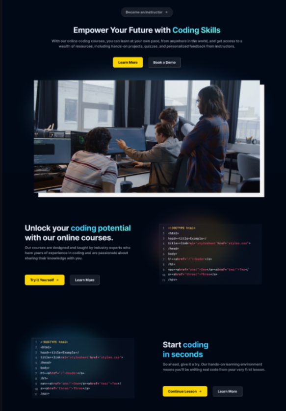
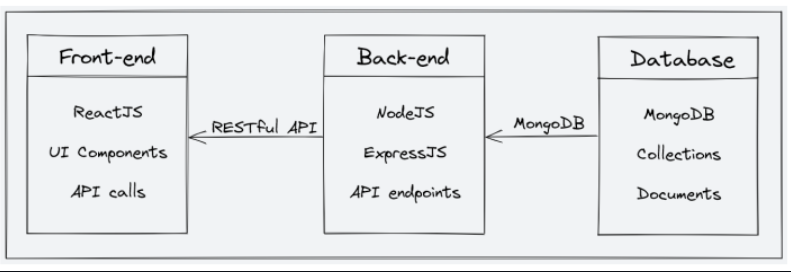

# 📘 StudyNotion – Online Education Platform (MERN Stack) 
### 🔗 Live Website
  👉 [Visit Web 🚀](https://abhidw1.github.io/StudyNotion/)

<u> </u>

## 📌 Project Description

**StudyNotion** is a fully functional **Ed-Tech platform** that enables users to **create, consume, and rate educational content**.  
The platform is built using the **MERN stack**, which includes **ReactJS, NodeJS, ExpressJS, and MongoDB**.

### 🎯 Objectives
StudyNotion aims to:
- Provide a **seamless and interactive learning experience** for students, making education more accessible and engaging.
- Offer a platform for **instructors to showcase their expertise** and connect with learners across the globe.

In the following sections, the **technical details** of the platform are covered, including architecture, frontend, backend, APIs, deployment, testing, and future improvements.

---

## 🧩 Technical Overview

The project documentation includes details about:

- **System Architecture**  
  High-level overview of platform components along with architecture diagrams.

- **Front-end**  
  Frontend architecture, UI design, features, functionalities, and tools/frameworks used.

- **Back-end**  
  Backend architecture, APIs, business logic, data models, and database schema.

- **API Design**  
  REST API endpoints, their functionalities, and sample request/response structures.

- **Deployment**  
  Deployment process, hosting environment, infrastructure, and configuration details.

- **Testing**  
  Testing approach, types of testing, and tools used.

- **Future Enhancements**  
  Planned improvements, their impact on the platform, and implementation priorities.

---

## 🏗 System Architecture

The **StudyNotion Ed-Tech platform** consists of three main components:

- **Front End (Client)**
- **Back End (Server)**
- **Database**

The platform follows a **client–server architecture**, where:
- The **front end** acts as the client.
- The **back end** and **database** serve as the server.

---

## 🎨 Front-end

The front end of the platform is built using **ReactJS**.

### Key Highlights:
- ReactJS enables the creation of **dynamic and responsive user interfaces**.
- A well-structured component-based architecture is used.
- The frontend communicates with the backend using **RESTful API calls**.
- Focused on delivering an **engaging learning experience** for students.

---

## ⚙️ Back-end

The back end of the platform is developed using **NodeJS and ExpressJS**.

### Responsibilities:
- Provides APIs for frontend consumption.
- Handles **user authentication**, **course creation**, and **course consumption**.
- Manages business logic for processing and storing course content.
- Ensures secure handling of user data.

---

## 🗄 Database

The database layer is implemented using **MongoDB**, a NoSQL database.

### Why MongoDB?
- Flexible and scalable data storage.
- Supports **unstructured and semi-structured data**.
- Well-suited for handling dynamic application data.

### Stored Data Includes:
- Course content
- User information
- Instructor details
- Other platform-related data

- ### 🏗 System Architecture

---

## 🎨 Front End

The **front end of StudyNotion** includes all the essential pages required for a modern **Ed-Tech platform**.  
It is designed to provide a **smooth, interactive, and user-friendly experience** for students, instructors, and (future scope) administrators.

---

### 👨‍🎓 For Students

- **Homepage**  
  Provides a brief introduction to the platform along with quick access to course listings and user details.

- **Course List**  
  Displays all available courses with descriptions, ratings, and key information.

- **Wishlist**  
  Shows courses that a student has saved for future reference.

- **Cart & Checkout**  
  Allows students to review selected courses and complete the purchase process.

- **Course Content**  
  Provides access to enrolled course materials, including videos and other learning resources.

- **User Details**  
  Displays student profile information such as name, email, and other account details.

- **Edit Profile**  
  Enables students to update and manage their account information.

---

### 👨‍🏫 For Instructors

- **Instructor Dashboard**  
  Provides an overview of created courses along with ratings and feedback.

- **Insights**  
  Displays detailed analytics such as course views, clicks, and performance metrics.

- **Course Management**  
  Allows instructors to create, update, delete courses, and manage course content and pricing.

- **View & Edit Profile**  
  Enables instructors to view and update their personal and professional details.

---

### 🛡 For Admin (Future Scope)

- **Admin Dashboard**  
  Provides an overview of the platform’s courses, instructors, and students.

- **Platform Insights**  
  Displays key metrics such as total users, courses, and overall revenue.

- **Instructor Management**  
  Allows management of instructor profiles, courses, and ratings.

- **Other Management Pages**  
  Includes user management and course management functionalities.

---

### 🛠 Front End Technologies Used

- **ReactJS** – For building dynamic and component-based user interfaces  
- **Tailwind CSS & CSS** – For responsive and modern UI styling  
- **Redux** – For efficient and centralized state management

The combination of these technologies ensures a **scalable, responsive, and maintainable front-end architecture**.

### 🧾 Summary

StudyNotion is a **versatile and intuitive Ed-Tech platform** designed to deliver an immersive learning experience for students while empowering instructors to share their expertise.  
The following sections provide a **comprehensive technical understanding** of the platform’s architecture, features, and overall functionality.

